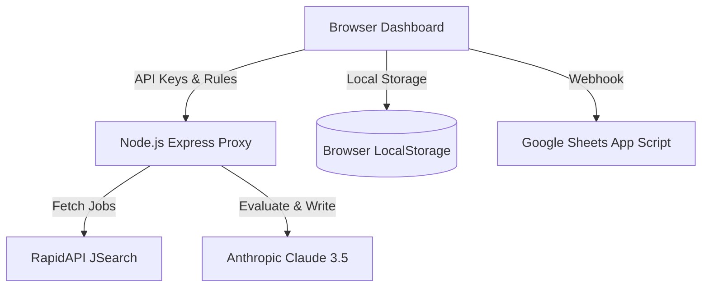

# ⚡ AI Job Agent

<div align="center">
  
  
  
  
</div>

<br />

An autonomous, production-ready AI agent that automates the tedious parts of your job search. Powered by **Anthropic's Claude 3.5**, it automatically searches for live jobs via the RapidAPI JSearch integration, rigorously evaluates them against your custom profile, generates highly tailored cover letters, and provides a 1-click "Apply Now" workflow.

---

## 📸 Product Interface

 to read your uploaded PDF resume and cross-reference it with live job descriptions to give a strict 0-100 compatibility score.
* **🔎 Live Job Sourcing**: Directly integrated with the RapidAPI JSearch network to pull real-time, real-world job postings across LinkedIn, Indeed, Glassdoor, and more.
* **✍️ Automated Cover Letters**: Generates tailored, personalized cover letters for every single job that passes your minimum scoring threshold.
* **🚀 1-Click Assisted Apply**: Automatically extracts the direct application URL. Just click "Apply Now", copy your generated cover letter to your clipboard, and hit submit.
* **📊 Analytics & Logging**: A beautiful, client-side dashboard tracking your application velocity, average scores, skipped jobs, and detailed scoring verdicts (including red flags).
* **☁️ Stateless Cloud Architecture**: Fully deployable to Render or Heroku. Uses local browser storage to ensure your API keys and job logs are completely private and secure on your own device.
* **📈 Google Sheets Webhook**: Optionally pushes a real-time CSV log of every evaluated and applied job directly to your Google Workspace.

---

## 🏗️ Architecture



The system operates as a Single Page Application (SPA) with a lightweight Express backend acting strictly as an API Gateway/Proxy to securely handle CORS and forward requests without exposing credentials.

---

## 🚀 Local Development Setup

### 1. Prerequisites
* Node.js v18.0 or higher
* [Anthropic API Key](https://console.anthropic.com)
* [RapidAPI JSearch Key](https://rapidapi.com/letscrape-6bRBa3QG1q/api/jsearch)

### 2. Installation
Clone the repository and install the minimal dependencies:
```bash
git clone https://github.com/YourUsername/ai-job-agent.git
cd ai-job-agent
npm install
```

### 3. Run the Server
Start the local proxy server:
```bash
npm start
```
*The dashboard will now be live at `http://localhost:3000`.*

---

## ☁️ Cloud Deployment (Render)

This application is configured for instant, 1-click deployment on [Render.com](https://render.com) using the included `render.yaml` Blueprint.

1. Push your code to a GitHub repository.
2. Log into Render and click **New + -> Blueprint**.
3. Connect your repository.
4. Render will automatically provision the Node service and start the agent.

**Note:** Because the backend is stateless, multiple users can use your hosted URL safely. Their data and API keys will be stored locally in their respective browsers.

---

## ⚙️ Configuration (UI)

Once you open the application, navigate to the **Setup & APIs** tab:
1. **API Keys**: Input your Anthropic and RapidAPI keys.
2. **Profile**: Upload your PDF resume. The system will parse the text locally.
3. **Criteria**: Set your job search terms (e.g., "Senior Frontend Engineer"), location, and minimum score threshold (e.g., 85/100).
4. **Run**: Click the "Run Agent" button and watch the logs populate!

---

## 🛡️ Privacy & Security
Your resumes, API keys, and job logs **never touch our database**. The Node.js server strictly acts as a pass-through proxy. All persistent state is saved directly inside your browser's `localStorage`.

---
*Built for the modern, autonomous developer.*
